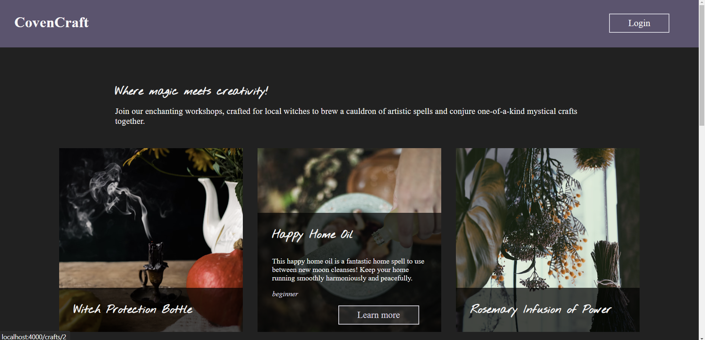

# CovenCraft 🌙🔮

## Where magick meets creativity! 

Welcome to CovenCraft, the enchanting social platform where magick and creativity intertwine! Our platform is designed for witches to come together and explore a magical realm of artistic spells through captivating workshops.

This application combines a React frontend with a Flask-SQLAlchemy backend to allow visitors to view a list of Crafts for those interested in adding a little magick to their life. Sign up or log in to save Crafts to your profile.

## Home

- [Starting the Application](#starting-the-application)
- [Using the Application](#using-the-application)
- [Attributions](#attributions)

## Intro To Project

- This project was made to complete the assignment `Phase 4 Project` for the `SE-West-091123` class for the [Flatiron](https://flatironschool.com/) Software Engineering Boot Camp.
- The project was completed using the following: `Flask-SQLAlchemy`, `React`, `React Router`, `Formik`, `Yup`, and `Bcrypt`.

## Starting the Application

- Fork and clone this repo, and open in your favorite code editor.
- In one terminal window:
  - Run `pipenv install && pipenv shell` to install packages and enter virtual environment.
  - Run `touch .env` in the main directory and open the new file.
  - In the `.env` file, insert `FLASK_RUN_PORT = 5555`,  `APP_SECRET = `
  - Enter the Flask shell using `flask shell`, then run `import secrets`, then `secrets.token_hex(32). Copy the output code.
  - Paste the code after `APP_SECRET = <paste here>` and exit the shell with `Ctrl-D`.
  - Enter the server directory using `cd server` and run `python seed.py`. It may take a moment to seed the database!
  - Run `python app.py` to start the server.
- In a second terminal window:
  - Enter the client directory using `cd client`, and run `npm i && npm start` to install necessary packages and start the program.

## Using the Application

- Explore the home page to view all crafts! Hover over the image to view a short summary.
- Click the `Learn more` button to view all the details of one craft.
- If you'd like to save crafts, log in or create a free account!
- Crafts can be saved to your profile. If you've changed your mind about a craft, go to it's page and remove it.

## Attributions

- The project was completed with collaboration from: `Kat Tannehill`, `Reilly Wentz`, and `Jazlin Yu`
- This project was created with combination of skills learned from the [Flatiron](https://flatironschool.com/) curriculum and our own individual research.
- Many of the photos used for the purposes of this project were supplied by [Unsplash](https://unsplash.com/).

## Join Us in Crafting Magick
Whether you're a novice or an experienced witch, CovenCraft welcomes you to join our mystical community. Unleash your creativity, connect with other witches, and make your craft truly magical.

May your spells be ever enchanting! 🌙🔮

[Back To Top](#home)
